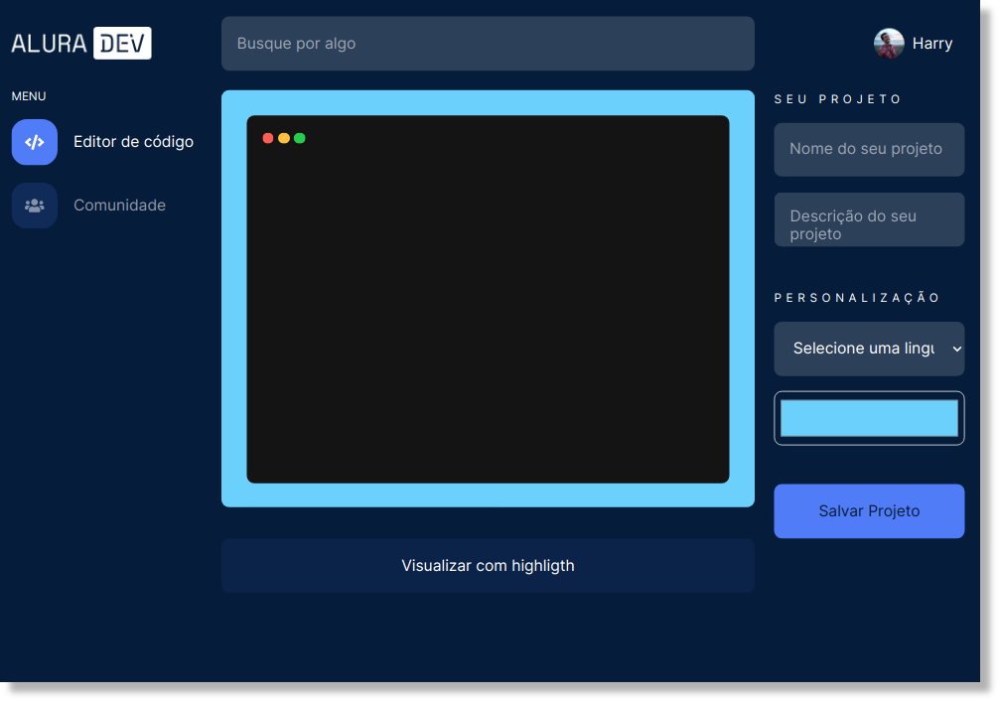

# aluradev
<p>
    
    <a href="https://github.com/my-study-area">
        
    </a>
    
    <a href="https://github.com/EliasGcf/readme-template/commits/master">
    
    </a>
</p>

Aluradev é uma pequena aplicação Frontend utilizando somente HTML, CSS e Javascript, desenvolvida durante a **Alura Challenge Front-End** da Alura. Nela é possível salvar blocos de códigos  semelhante a aplicações como [Gist](https://gist.github.com/), [Codepen](https://codepen.io/) e etc, porém, salvando localmente através do Local Storage.



A aplicação está disponível em [adrianoavelino.github.io/aluradev](https://adrianoavelino.github.io/aluradev/).

## Sobre
Um produtor de conteúdo de programação solicitou a construção de um editor de texto online para postar trechos de códigos em suas redes sociais. Para ele, o editor precisa ter um layout acessível, simples, bonito e funcional, para que ele possa, inclusive, compartilhar a ferramenta com seus seguidores e seguidoras.

As principais funcionalidades pedidas são: um campo para selecionar a linguagem a ser escrita; um campo de texto para escrever o código em si; e um botão para visualização deste código com o sintaxe highlight com um tema bem bonito. É importante que esse projeto seja escalável, ao ponto que, se for necessário adicionar alguma funcionalidade (feature), seja simples fazê-la. Como esse editor é online, é de extrema importância que ele seja responsivo.

## Tecnologias
- HTML
- CSS
- Javascript
- Highlight.js
- Browsersync (ambiente de desenvolvimento)
- Node/NPM (ambiente de desenvolvimento)

## Começando
> Obs: caso não tenha o Browsersync instalado, execute o seguinte comando: `npm install -g browser-sync`
```bash
# clona o projeto
git clone https://github.com/adrianoavelino/aluradev.git

# entra no diretório da aplicação
cd aluradev

# inicia a aplicação
browser-sync start --server --files "*.html, assets/css/**/*.css, assets/js/*.js"
```
